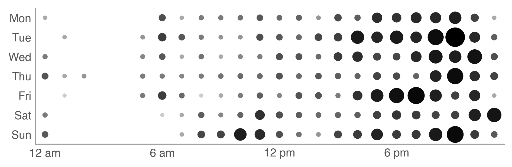

# Twitter Punchcards

Python script to generate Twitter "punchcards" showing at what times in the
week a Twitter account tweets at.

All timestamps are in the time zone of the account the punchcard is about and
all circles are scaled relative to the largest circle.

For example, my account is currently in UTC+0100. Therefore, the punchcard
starts at 00:00 UTC+0100 (or 23:00 UTC+0000). I tweet most frequently at 22:00,
so all the other circles are scaled relative to that circle.



In the future, I would like to scale the circles absolutely so you can compare
how frequently you tweet with other accounts.

## Installation

Make sure you have [Matplotlib](https://matplotlib.org/) installed.

## Usage

First, create a Twitter application and [generate an access
token](https://developer.twitter.com/en/docs/basics/authentication/guides/access-tokens).

```bash
# Configure the Twitter OAuth token
export TWITTER_CONSUMER_KEY="XXXXXXXXXXXXXXXXXXXXXXXXX"
export TWITTER_CONSUMER_SECRET="XXXXXXXXXXXXXXXXXXXXXXXXXXXXXXXXXXXXXXXXXXXXXXXXXX"
export TWITTER_ACCESS_TOKEN="XXXXXXXXXX-XXXXXXXXXXXXXXXXXXXXXXXXXXXXXXXXXXXXXXX"
export TWITTER_ACCESS_TOKEN_SECRET="XXXXXXXXXXXXXXXXXXXXXXXXXXXXXXXXXXXXXXXXXXXXX"
# Generate a PNG image for the authenticated user
./punchcard.py -o punchcard.png
# Generate a PNG image for @Twitter
./punchcard.py -o twitter.png Twitter
```
